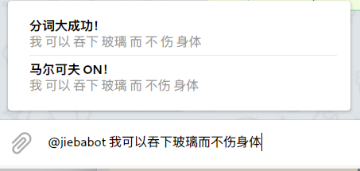

=========
Jieba-bot
=========
This is a simple Telegram inline bot providing Chinese word segmentation powered
by the Jieba algorithm.

The official instance is `@jiebabot <https://t.me/jiebabot>`_.

Build
-----
Requries rustc 1.39+ for async/await.

.. code:: sh

    export BOT_TOKEN=xxxxxxx # token is read at compile time
    # debug build
    cargo build
    # or, optimized build
    cargo build --release

Running
-------
Just run the executable! You may also want to set the log level by setting
``RUST_LOG`` environment variable. See |log_crate|_.

.. |log_crate| replace:: the `log` crate
.. _log_crate: https://docs.rs/log

.. code:: sh

    RUST_LOG=info cargo run --release

Alternatively, you can use systemd to manage the service. A demonstration
systemd service file is included. Place the service file in
``/etc/systemd/system``, put the executable in ``/usr/local/bin/jieba-bot``, and
issue a ``systemctl daemon-reload``. Then you can start and enable the service
using normal systemd commands.

Miscellaneous
-------------
Q: Why not write this in Python?

A: Because I'm afraid of programming in dynamic-typed languages :)

Privacy
-------
This bot records nothing at all. All messages are discarded once processed.

License
-------
This work is released under the WTFPL license. A copy of the license is provided
in the LICENSE file.
